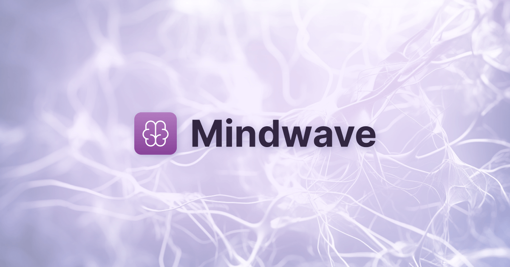
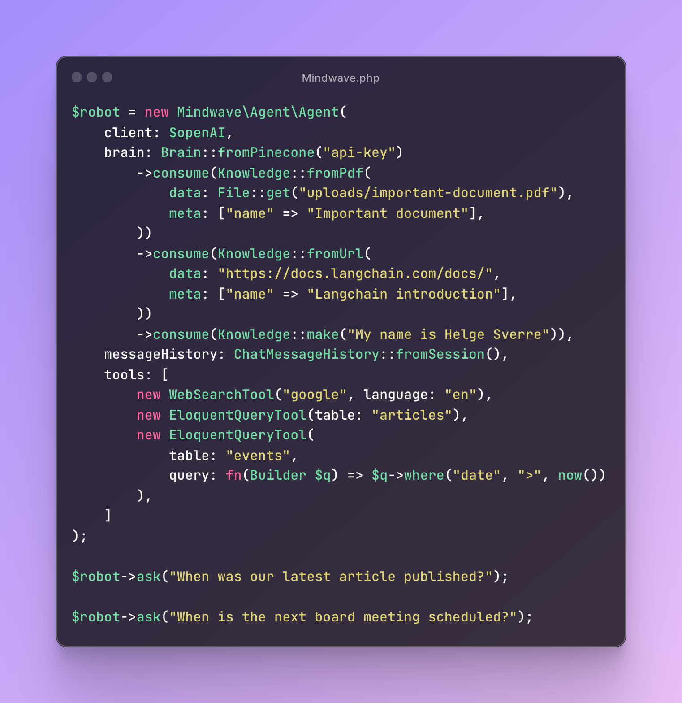

[](https://packagist.org/packages/mindwave/mindwave)
[](https://github.com/mindwave/mindwave/actions?query=workflow%3Arun-tests+branch%3Amain)
[](https://github.com/mindwave/mindwave/actions?query=workflow%3A"Fix+PHP+code+style+issues"+branch%3Amain)
[](https://packagist.org/packages/mindwave/mindwave)

# Mindwave: AI Chatbots, Agents & Document Q&A in Laravel Simplified.

## Installation

You can install the package via composer:

```bash
composer require mindwave/mindwave
```

You can publish and run the migrations with:

```bash
php artisan vendor:publish --tag="mindwave-migrations"
php artisan migrate
```

You can publish the config file with:

```bash
php artisan vendor:publish --tag="mindwave-config"
```

## What is Mindwave?

Mindwave is a Laravel package that lets you easily build AI-powered chatbots, agents, and document question and
answering (Q&A) functionality into your application.

With Mindwave, you can incorporate the power of OpenAI's state-of-the-art language models, Pinecone's vector search
capabilities and your own custom "tools" to create intelligent software applications.

## Example



```php
$mindwave = new Mindwave\Mindwave();
// TODO: Implement example
```

```php
// TODO: Remove this old example code, its for "API" reference
<?php

$client = OpenAI::client(config('mindwave.openai.api_key'));

$robot = Mindwave\Mindwave::agent()->make(
    client: $openAI,
    brain: Brain::fromPinecone("api-key")
        ->consume(Knowledge::fromPdf(
            data: File::get("uploads/important-document.pdf"),
            meta: ["name" => "Important document"],
        ))
        ->consume(Knowledge::fromUrl(
            data: "https://docs.langchain.com/docs/",
            meta: ["name" => "Langchain introduction"],
        ))
        ->consume(Knowledge::make("My name is Helge Sverre")),
    messageHistory: ChatMessageHistory::fromSession(),
    tools: [
        new WebSearchTool("google", language: "en"),
        new EloquentQueryTool(table: "articles"),
        new EloquentQueryTool(
            table: "events",
            query: fn(Builder $q) => $q->where("date", ">", now())
        ),
    ]
);

$robot->ask("When was our latest article published?");

$robot->ask("When is the next board meeting scheduled?");
```

## Use Cases

- 💬 **Chatbots**: Building AI-powered chatbots to provide support to customers.
- 🤖 **Agents**: Developing intelligent agents to automate tasks within an application.
- ❓ **Document Q&A**: Creating document question and answering (Q&A) systems to extract insights from text.

## Technical

- Mindwave makes it easy to generate embeddings for many types of documents (text, pdf, html, csv, json, etc), store
  those embeddings in a Vector database.
- Using pre-made prompts you can instruct an Agent to run custom "tools" that can perform an action in your codebase,
  lookup specific information from an external source, search your vector database for semantically similar information
  and use the result of that action to generate an answer.

## Support

Mindwave is "driver" oriented, this means you can swap out the parts to suite your needs and use-cases.

### Vector databases

| Name     | Supported?    |
|----------|---------------|
| Pinecone | Yes           |
| Weaviate | No (planned)  |
| pgvector | No  (planned) |

### LLMs

| Name               | Supported?        |
|--------------------|-------------------|
| OpenAI Chat models | Yes (Recommended) |
| OpenAI Completion  | Yes               |
| Cohere AI          | No (planned)      |

### Embeddings

| Name                | Supported?        |
|---------------------|-------------------|
| OpenAI text-ada-002 | Yes (Recommended) |
| TODO #1             | No                |
| TODO #2             | No                |
| TODO #3             | No                |

- Mindwave provides an easy-to-use API for integrating OpenAI's GPT models and Pinecone's vector search capabilities
  into
  your Laravel app.
- Mindwave uses Pinecone's vector search to find similar documents, which can be useful for document Q&A and other
  natural language processing tasks.
  Mindwave supports Laravel version 10.x or higher.
  Getting started with Mindwave is easy - just install the package and start building intelligent software applications
  with AI-powered chatbots, agents, and document Q&A. Try it today and experience the power of Mindwave for yourself!
  Sure, here's a "Known Limitations" section for the Mindwave Laravel package's readme:

## Known Limitations

While Mindwave offers powerful AI capabilities, there are some limitations to keep in mind:

| Limitation      | Description                                                                                                                     |
|-----------------|---------------------------------------------------------------------------------------------------------------------------------|
| Hallucination   | Large language models (LLMs) like OpenAI's GPT models can occasionally produce nonsensical responses or "hallucinate".          |
| English-Centric | While you can configure Mindwave to respond in different languages, it may not always be accurate or natural-sounding.          |
| Context Length  | OpenAI's GPT models have a hard limit on the length of the input context they can process, which varies depending on the model. |

Here are the current context length limits for some of the OpenAI models supported by Mindwave:

| Model ID         | Max Tokens |
|------------------|------------|
| text-davinci-003 | 4,097      |
| gpt-3.5-turbo    | 4,096      |
| gpt-4            | 4,096      |

It's important to keep these limitations in mind when building applications with Mindwave, and to test and evaluate the
results carefully to ensure the desired outcomes are being achieved.

## Testing

```bash
composer test
```

## Documentation

Please see [here](docs/start.md) for the full documentation.

## Changelog

Please see [CHANGELOG](CHANGELOG.md) for more information on what has changed recently.

## Credits

- [Helge Sverre](https://github.com/helgesverre)
- [Probots.io](https://github.com/probots-io) for the [Pinecone PHP Client](https://github.com/probots-io/pinecone-php)
- [Tim Kleyersburg](https://github.com/timkley) for the [Weaviate PHP Client](https://github.com/timkley/weaviate-php)
- [All Contributors](../../contributors)

## License

The MIT License (MIT). Please see [License File](LICENSE.md) for more information.
